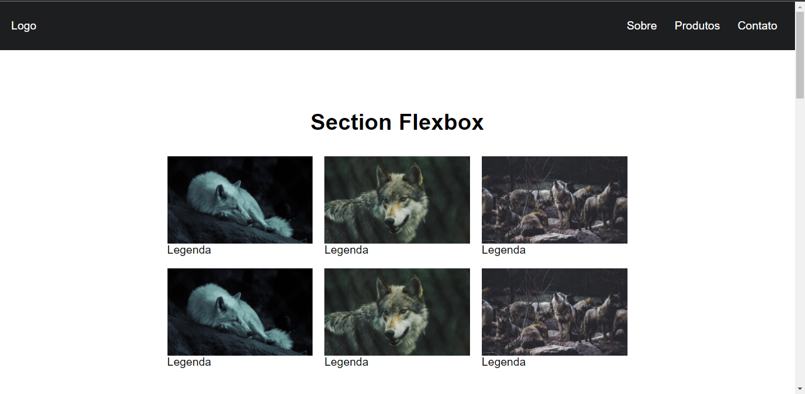
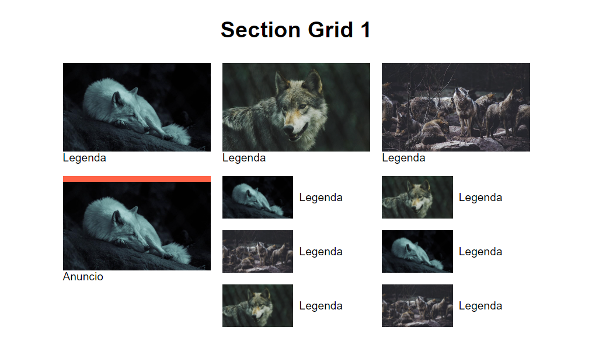
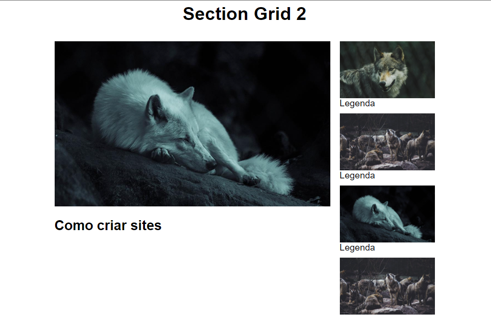
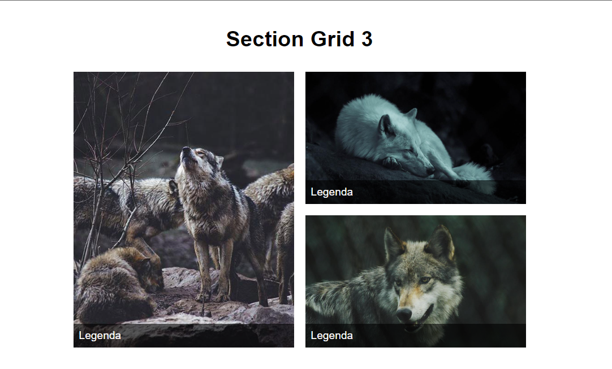

# CSS Grid Layout e Flexbox

## Flexbox

## Grid 1

## Grid 2

## Grid 3

# Links

<ul>
  <li><a href="http://https://www.origamid.com/curso/css-flexbox/"> CSS - Flexbox</a>
  <li><a href="https://www.youtube.com/watch?v=x-4z_u8LcGc">CSS Grid Layout e Flexbox - Quando Utilizar
  <li><a href="https://github.com/origamid/publico/tree/main/css-grid-layout-e-flexbox-quando-utilizar">Repositório</a>
</ul>

# Creator

## Vini Santos :computer: